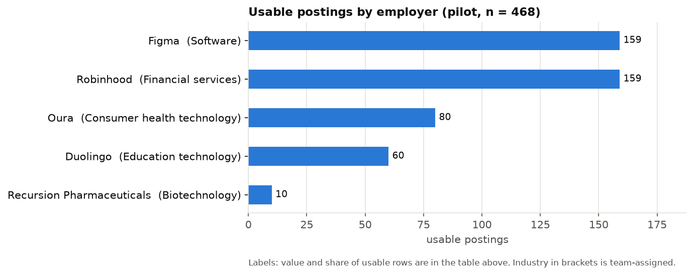
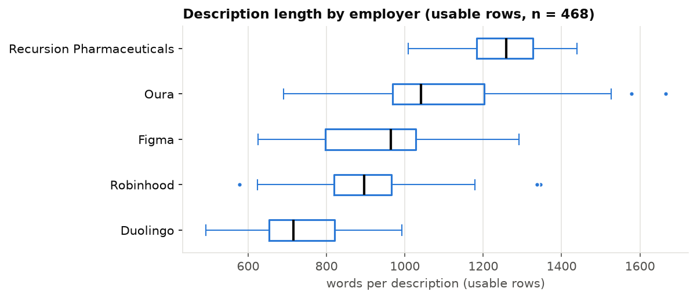
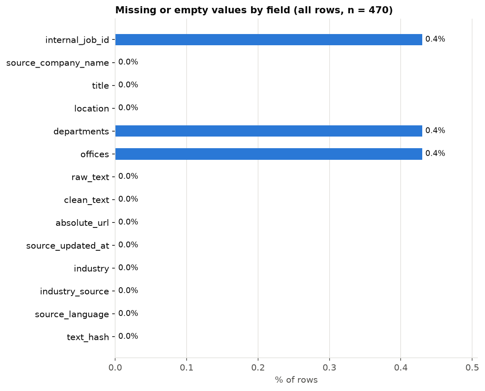
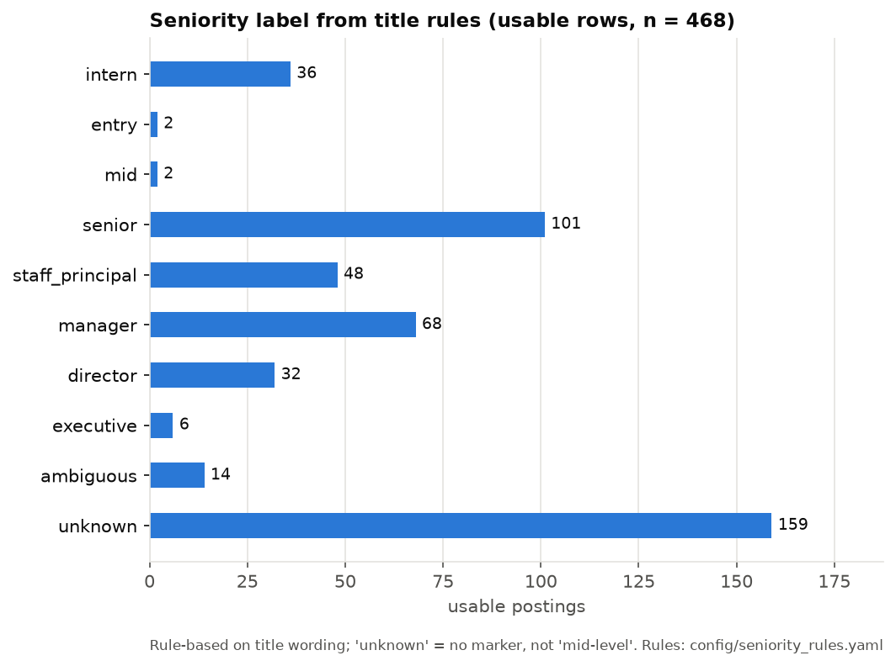
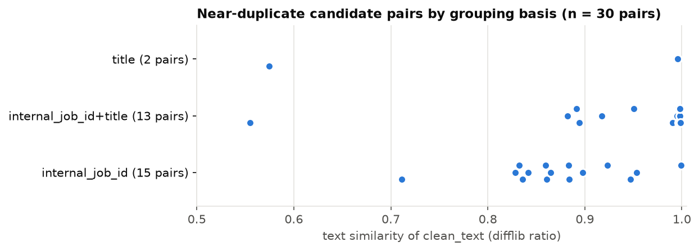

# Sprint 1 Exploration: Greenhouse Pilot (Section B)

**Status:** PILOT findings. These are not Sprint 1 deliverable conclusions. The corpus is five
employers from one snapshot (`20261006T171338Z`), and the board list is a proposal pending
Section A. **Industry labels are team-assigned, one per employer**, so "by industry" means
"by employer" here.

- **Notebook:** `notebooks/sprint1_exploration.ipynb`, executed end to end. It opens
  `data/processed/taxonomy_pilot.sqlite` read-only and filters every query to the snapshot.
- **Metrics:** `reports/sprint1_exploration_metrics.json`.
- **Charts:** `reports/figures/`.
- **Derived features:** `src/derive_features.py`, stored outside the `postings` table.
- **Denominators:** **all rows = 470** (flagged rows included) and **usable rows = 468**
  (empty `exclusion_reason`). The denominator is stated with every figure.

## 1. Corpus size and exclusions

| | Count | Share of all rows |
|---|---|---|
| All rows | 470 | 100% |
| Usable rows | 468 | 99.6% |
| Flagged (kept in the DB, excluded from `usable_postings`) | 2 | 0.4% |

Both flagged rows are Recursion general-interest postings:
- "Don't see what you're looking for?" (`placeholder_title:dont_see_role`)
- "Interested in an internship?" (`placeholder_text:join_talent_pool`)

The rules are heuristic: title patterns plus two narrow description phrases.

## 2. Employers and concentration

| Employer (industry, team-assigned) | All rows | Usable rows | Share of usable |
|---|---|---|---|
| Figma (Software) | 159 | 159 | 34.0% |
| Robinhood (Financial services) | 159 | 159 | 34.0% |
| Oura (Consumer health technology) | 80 | 80 | 17.1% |
| Duolingo (Education technology) | 60 | 60 | 12.8% |
| Recursion Pharmaceuticals (Biotechnology) | 12 | 10 | 2.1% |

- **The pilot is concentrated.** The top two employers make up **67.9%** of usable rows. The
  HHI of usable shares is **0.277**, against 0.200 for a perfectly even split across five
  employers.
- **Biotechnology has only 10 usable postings.** Any industry comparison would really be a
  comparison of five companies.

## 3. Departments and locations (all rows, n = 470)

- **Departments:** there are 96 distinct names. They are employer-specific and not
  harmonised: Robinhood alone uses 58, Figma 13. Department is not a usable cross-employer
  field without mapping.
- **Locations:** there are 63 distinct strings, written in free text with employer-specific
  formats (`;` vs `•`, "Hybrid - …", "Remote - …").
  - **212 / 470 (45.1%)** list several locations.
  - **35 / 470 (7.4%)** mention "remote".
  - No geocoding was done.

## 4. Description length

- **Overall (usable rows, n = 468):** median **927** words, range 492–1,665.
- **By employer (median):** Duolingo 715 (shortest) and Recursion 1,258 (longest).
- **Boilerplate:** the counts include company intros, benefits and EEO text, which are
  probably a large share of each posting. They are **not** the length of the
  requirements sections. Sprint 2 extraction will need section-level handling.

## 5. Missing fields (all rows, n = 470)

- **Nearly complete:** only `internal_job_id`, `departments` and `offices` have any missing
  values. Each has **2 / 470 (0.4%)** missing, and all of them belong to the two Recursion
  placeholder rows. Every other checked field is 100% present.
- **Not provided by Greenhouse at all:** `industry` (assigned by the team instead) and
  `seniority` (derived; see §7).

## 6. Exact duplicates vs repeated titles

- **Exact duplicates** (identical normalized `clean_text`): **0 of 470 rows with text
  (0.0%)**.
- **Repeated titles:** **13 groups covering 27 rows** share a board and a normalized title.
  **None** have identical text in every row, so they are **not** duplicates and are reported
  separately.

## 7. Seniority (rule-based, from title wording only)

The rules are in `config/seniority_rules.yaml` (v0.1.0, SHA-256 stored per row). Results are
in `data/processed/derived/seniority_20261006T171338Z.csv`.

| Label | Usable rows (n = 468) |
|---|---|
| unknown (no marker) | 159 (34.0%) |
| senior | 101 (21.6%) |
| manager | 68 (14.5%) |
| staff_principal | 48 (10.3%) |
| intern | 36 (7.7%) |
| director | 32 (6.8%) |
| ambiguous | 14 (3.0%) |
| executive | 6 (1.3%) |
| entry / mid | 2 / 2 |

- **`unknown` is the largest class,** and it means "no marker", not "mid-level". At Figma it
  is 102 of 159 rows. 22 unknown titles are "Account Executive …", a sales role that the
  rules deliberately do not treat as executive.
- **Manual review.** I reviewed a fixed-seed sample of 20 titles and all 34 rows where more
  than one rule matched. Precedence behaves as intended:
  - "Senior Engineering Manager" becomes manager.
  - "Associate Director" becomes director.
  - "Executive Assistant to the CEO" becomes unknown.
  - "Senior/Software Engineer II" becomes ambiguous.
- **Limitations:**
  - "manager" does not prove people management. "Accounting Manager" and "Logistics
    Manager" are labelled manager.
  - Robinhood's 26 interns inflate `intern` (7.7%).
  - Only 2 titles carry an explicit entry marker.
  - There is no ground truth, so these labels describe **title wording**, not verified levels.

## 8. Language: detected vs source

- **Detector:** local `lingua-language-detector` 2.2.0. No LLM and no API.
- **Columns kept separately:** `source_language` (employer-set, unchanged) and
  `detected_language`. Results are in `data/processed/derived/language_20261006T171338Z.csv`.
- **Result:** detected **en for 470 / 470** rows.
  - **0 uncertain:** minimum whole-text confidence 1.00, and no other-language paragraphs.
  - **0 disagreements** with `source_language`.
- **Manual inspection:**
  - **Fixed-seed sample:** 12 postings, half of them from non-US locations. All are English.
  - **Location check:** all **43** postings in Tokyo, Beijing, Paris, Berlin, São Paulo,
    Singapore, Bengaluru and Ljubljana are detected as English. Their only non-ASCII letter
    is the "ã" in "São Paulo", so there is no Japanese, Chinese or other non-Latin text.
- **Detector caveat found while testing:**
  - **The flip:** on mixed-language input, lingua's whole-text label can follow the minority
    language with confidence 1.0. Six English paragraphs plus one French paragraph came out
    as "fr".
  - **What the label uses instead:** the paragraph word-majority.
  - **When a row is flagged uncertain:** if the paragraph label and the whole-text label
    disagree, or if any paragraph is in another language.
  - **Pilot impact:** none, because no pilot posting is mixed. It will matter if the corpus
    later includes non-English boards.

## 9. Near-duplicate candidates (for review; nothing excluded)

Candidate groups are built **within one board** from a shared `internal_job_id` or the same
normalized title, and **all pairs** in each group are compared. The output,
`reports/sprint1_near_duplicate_candidates_20261006T171338Z.csv`, lists **30 candidate
pairs**:
- 23 Robinhood, 6 Duolingo, 1 Recursion
- by basis: 15 `internal_job_id`, 13 both, 2 title

Each pair has its posting IDs, titles, locations, difflib similarity and token Jaccard.

- **Same role, different location (9 pairs ≥ 0.99):** for example, Duolingo "Senior Creative
  Director, Marketing" in New York vs London, and Robinhood "Product Marketing Manager,
  International" in London, Luxembourg and Ljubljana (3 rows, 3 pairs). The texts differ in
  location, salary or benefits lines.
- **One requisition, two titles:** Duolingo "Ad Sales Lead - West" and "Director of Ad Sales -
  West" share an internal job ID at 0.999 similarity.
- **Shared requisition, different teams (0.83–0.90):** for example, Robinhood "Android
  Engineer, Government Products / Money Experience / Social". These are probably distinct
  team postings rather than duplicates.
- **Same title, different roles (< 0.60):** for example, Robinhood "Financial Operations
  Manager" in Singapore vs the US.

**Not every near-duplicate is detected.** Figma's location-suffixed titles, such as "Account
Executive, Enterprise (Paris, France)" and its variants, have distinct titles and internal IDs,
so neither rule groups them. Cross-board duplicates are also out of scope. We need to decide
how to handle candidates before reporting a duplicate rate or extracting skills, because
location variants would otherwise double-count the same requirements.

## 10. Integrity

The notebook hashes the database and the 5 raw files before and after the analysis, and all
6 are byte-identical. The derivation script opens SQLite with `mode=ro`. A separate shell check
after execution matched as well.

## 11. Implications and open items (Sprint 1 stays open)

- [ ] **Corpus:** agree the board list with Section A. Five employers, two of which hold 68%,
  is too narrow for taxonomy work.
- [ ] **Near-duplicates:** decide a policy, for example keeping one row per `internal_job_id`
  and location group with similarity ≥ 0.99. It has to be documented before the duplicate
  rate is final.
- [ ] **Boilerplate:** handle the shared intro, benefits and EEO text before extraction
  (Sprint 2).
- [ ] **Department harmonisation:** needed if departments are to be used across employers.
- [ ] **Seniority:** review the rules on the full corpus, and consider a small hand-labelled
  check set.
